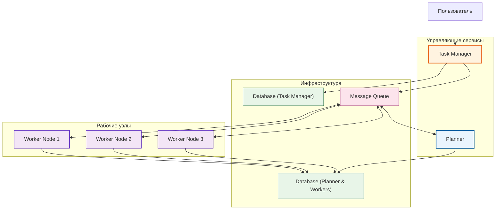

# Техническое решение проекта «Map-Reduce word count»

## Введение

**Цель проекта:**
Разработать распределенную систему на основе парадигмы Map-Reduce для задачи подсчета количества слов в документе (word count). Проект служит демонстрацией принципов распределенных вычислений и отказоустойчивой обработки данных.

**Основания для разработки:**
Учебный проект в рамках курса «Основы распределенных вычислений». Проект демонстрирует практическое применение MapReduce-подхода для обработки текстовых документов.

**Команда:**
- Александр Кука – Разработчик / Архитектор
- Клименко Степан – Аналитик / Тестировщик  
- Окудаева Варвара – Data Engineer

---

## Глоссарий

| Термин | Определение |
|---|---|
| **MapReduce** | Модель распределённых вычислений для параллельной обработки больших данных путем разделения задачи на этапы |
| **Map (Фаза отображения)** | Стадия обработки, на которой входные данные разбиваются на части и обрабатываются параллельно для генерации промежуточных пар ключ-значение |
| **Reduce (Фаза свертки)** | Стадия обработки, на которой промежуточные данные группируются по ключу и агрегируются для формирования финального результата |
| **Planner (Планировщик)** | Компонент, отвечающий за нарезку задач на части и распределение частей по узлам |
| **Task Manager** | Центральный сервис, управляющий жизненным циклом задачи: получение задачи, контроль выполнения, выдача результатов |
| **Универсальный Узел (Worker Node)** | Вычислительный узел в кластере, способный выполнять как Map так и Reduce задачи |
| **Shuffle & Sort** | Этап между Map и Reduce, на котором промежуточные пары ключ-значение группируются по ключу и сортируются перед отправкой на Reduce-узлы |
| **Чанк (Chunk)** | Часть входного документа, обрабатываемая на этапе Map |
| **Воркер (Worker)** | Процесс, выполняющий задачи Map или Reduce на узле |

## Функциональные требования

Система должна предоставлять следующие функции:

1. **Загрузка документа** – Пользователь загружает текстовый документ через Task Manager
2. **Распределение задач** – Planner разбивает документ на чанки и распределяет Map-задачи между доступными узлами
3. **Параллельный подсчет слов** – Узлы выполняют Map-задачи, обрабатывая свои чанки и генерируя промежуточные данные (`<слово, 1>`)
4. **Сохранение промежуточных результатов** – Результаты Map-этапа сохраняются в БД для обеспечения отказоустойчивости
5. **Агрегация результатов** – Система автоматически выполняет этап Shuffle & Sort, группируя промежуточные данные по словам
6. **Формирование выходного файла** – Узлы, назначенные на Reduce-задачи, суммируют количества для каждого слова
7. **Сохранение финальных результатов** – Финальный результат сохраняется в базу данных
8. **Уведомление о завершении** – Task Manager отслеживает результат и уведомляет пользователя о завершении задачи

## Нефункциональные требования

**Производительность**
- Обработка документа объемом 1 ГБ должна быть завершена не более чем за 10 минут
- Система должна демонстрировать линейное или близкое к линейному ускорение при добавлении новых узлов

**Масштабируемость**
- Архитектура позволяет горизонтально масштабироваться за счет добавления новых Универсальных Узлов

**Надежность и отказоустойчивость**
- Task Manager должен отслеживать "здоровье" узлов
- В случае падения узла задача должна быть переназначена другому доступному узлу с механизмом дедупликации
- Промежуточные результаты этапа Map сохраняются в устойчивое хранилище для избежания потерь
- Обнаружение и повторная обработка потерянных чанков

**Простота использования**
- Процесс загрузки документа и получения результата должен быть интуитивно понятен

## Модель взаимодействия

**Асинхронная коммуникация**
- Все взаимодействия между компонентами реализуются через асинхронные сообщения
- Task Manager и Planner взаимодействуют через очередь задач
- Worker узлы получают задачи через брокер сообщений
- Через брокер передаются ссылки на входные и выходные данные, которые хранятся в DB_PW
- Промежуточные результаты сохраняются в БД асинхронно

**Преимущества асинхронного подхода:**
- Отказоустойчивость - сообщения не теряются при временной недоступности компонентов
- Масштабируемость - можно добавлять обработчиков без изменения архитектуры
- Развязка компонентов - каждый сервис работает независимо

## Пользовательские сценарии

**Сценарий: Постановка задачи на обработку**
1. Пользователь загружает документ через Task Manager
2. Система подтверждает прием задачи и присваивает идентификатор
3. Пользователь получает идентификатор для отслеживания статуса

**Сценарий: Получение результата обработки**
1. Пользователь запрашивает статус задачи по идентификатору
2. Система возвращает текущий статус выполнения
3. При завершении обработки пользователь получает файл с результатами подсчета слов

## Архитектура системы

Система построена по гибридной архитектуре "Master-Worker" в рамках парадигмы MapReduce.

### Компоненты системы

**Task Manager**
- Центральный сервис управления задачами
- Принимает задачи от пользователя и выдает результаты
- Управляет жизненным циклом задачи
- Отслеживает статус выполнения через базу данных (DB_TM)
- Уведомляет пользователя о завершении

**Planner**
- Принимает задачи из очереди сообщений
- Разбивает документы на чанки (параметризуемое количество)
- Распределяет Map и Reduce задачи между Worker узлами через брокер сообщений
- Обрабатывает сбои узлов с механизмом дедупликации
- Использует отдельную базу данных (DB_PW) для хранения входных, промежуточных и финальных данных

**Workers**
- Исполняющие узлы, способные выполнять обе функции:
- **Map**: Принимает фрагмент текста, разбивает на отдельные слова, формирует промежуточные результаты в формате "(<слово>, 1)" и сохраняет в DB_PW
- **Reduce**: Получает сгруппированные данные по определённым словам, складывает все единицы и вычисляет итоговое количество для каждого слова

**Message Queue (Брокер сообщений)**
- Обеспечивает асинхронную коммуникацию между компонентами
- Гарантирует доставку сообщений даже при временной недоступности компонентов
- Поддерживает персистентное хранение задач
- Обеспечивает механизм подтверждения обработки

**Базы данных**
- DB_TM (Task Manager Database) — хранит метаданные задач: ID, статус, ссылку на файл с исходными данными
- DB_PW (Planner & Worker Database) — хранит входные, промежуточные и итоговые данные, необходимые для выполнения задач

## Технические сценарии

### Сценарий 1: Успешное выполнение задачи

1. **Инициализация задачи:**
   - Пользователь загружает документ через Task Manager, указывая количество чанков n
   - Task Manager сохраняет метаданные задачи в DB_TM: ID, статус, ссылка на задачу/файл
   - Task Manager публикует сообщение о новой задаче в брокер сообщений

2. **Планирование и распределение Map-задач:**
   - Planner получает сообщение о задаче из брокера сообщений
   - Planner читает документ из DB_PW и разбивает его на n чанков
   - Planner публикует n Map-задач в брокер сообщений

3. **Выполнение Map-фазы:**
   - n доступных Worker узлов получают Map-задачи из брокера сообщений
   - Каждый Worker выполняет Map-обработку своего чанка, генерируя промежуточные данные
   - Worker сохраняет промежуточные результаты в DB_PW
   - Worker отправляет подтверждение выполнения в брокер сообщений

4. **Координация Reduce-фазы:**
   - Planner отслеживает завершение всех Map-задач через сообщения в брокере
   - После получения всех подтверждений Planner публикует Reduce-задачи в брокер сообщений
   - Reduce-задачи распределяются между доступными Worker узлами

5. **Выполнение Reduce-фазы:**
   - Worker узлы получают Reduce-задачи из брокера сообщений
   - Workers читают сгруппированные промежуточные данные из DB_PW
   - Workers выполняют Reduce-обработку, суммируя значения для каждого слова
   - Workers сохраняют финальные результаты в DB_PW
   - Workers отправляют подтверждения выполнения в брокер сообщений

6. **Завершение задачи:**
   - Task Manager отслеживает статус задачи через DB_TM
   - При обнаружении финальных результатов Task Manager уведомляет Planner о завершении
   - После получения финальных результатов от Planner Task Manager уведомляет пользователя о готовности результата
   
### Сценарий 2: Обработка сбоя узла во время Map-фазы

1. Worker Node перестает отвечать во время выполнения Map-задачи
2. Planner обнаруживает сбой через механизм health-check (таймауты)
3. Planner проверяет в DB_PW - промежуточные результаты не сохранены
4. Planner повторно ставит Map-задачу в очередь
5. Другой Worker обрабатывает чанк и сохраняет результаты в DB_PW
6. Процесс продолжается с этапа Shuffle & Sort

### Сценарий 3: Обработка сбоя узла после Map-фазы

1. Worker Node завершил Map-обработку и сохранил результаты в DB_PW
2. Узел перестает отвечать перед Reduce-фазой
3. Planner обнаруживает сбой, но видит в DB_PW сохраненные промежуточные результаты
4. Planner назначает Reduce-задачу другому узлу, используя сохраненные данные
5. Потеря данных не происходит

## План разработки
### MVP
1. **Реализация Task Manager** (прием задач от пользователя, управление жизненным циклом задачи, выдача результатов)
2. **Реализация Planner** (разбиение документов на чанки, распределение Map и Reduce задач)
3. **Реализация Worker узлов** (выполнение Map операций - разбиение текста на слова)
4. **Реализация базового Shuffle & Sort** (группировка промежуточных данных по словам)
5. **Интеграция с базой данных** (хранение документов, промежуточных и финальных результатов)
6. **Интеграция брокера сообщений RabbitMQ** (асинхронная коммуникация между компонентами)

### Детальный план реализации

**Фаза 1: Прототип на одном узле**
- Цель: Реализовать логику Map и Reduce в рамках одного приложения
- Результат: Консольное приложение для word count

**Фаза 2: База данных и асинхронная коммуникация**
- Цель: Реализовать устойчивое хранение и брокер сообщений
- Результат: Интеграция с БД и Message Queue

**Фаза 3: Planner и один Worker (MVP)**
- Цель: Разделить ответственность между компонентами
- Результат: Два приложения, коммуницирующих через MQ

**Фаза 4: Распределение Map-задач**
- Цель: Реализовать запуск нескольких Worker'ов
- Результат: Planner может отправить чанки разным Worker'ам

**Фаза 5: Shuffle & Sort и Reduce-задачи**
- Цель: Организовать передачу данных между Worker'ами
- Результат: Полностью работоспособный конвейер MapReduce

**Фаза 6: Task Manager и отказоустойчивость**
- Цель: Добавить централизованное управление и механизмы восстановления
- Результат: Полная отказоустойчивость системы

**Фаза 7: Пользовательский веб-интерфейс**
- Цель: Предоставить удобный способ взаимодействия
- Результат: Веб-интерфейс для загрузки документов и получения результатов

## Тестирование

**Интеграционное тестирование (Integration Testing)**
- Тестирование взаимодействия между **Planner** и **Worker**
- Тестирование взаимодействия **Worker** с БД
- Тестирование цикла **Task Manager** → **БД** → **Planner**

**Системное тестирование (System / End-to-End Testing)**
- Запуск всего кластера с тестовыми документами разного размера
- Проверка корректности и полноты итогового результата
- Проверка работы под нагрузкой

**Тестирование отказоустойчивости (Failure Testing)**
- Имитация падения Worker'а во время выполнения задач
- Проверка переназначения задач и корректности конечного результата
- Проверка восстановления системы после перезапуска узлов

### DOD
- Система должна корректно решать задачу подсчета слов (word count)
- Система должна решать задачу распределено в соответствии с заявленной архитектурой
